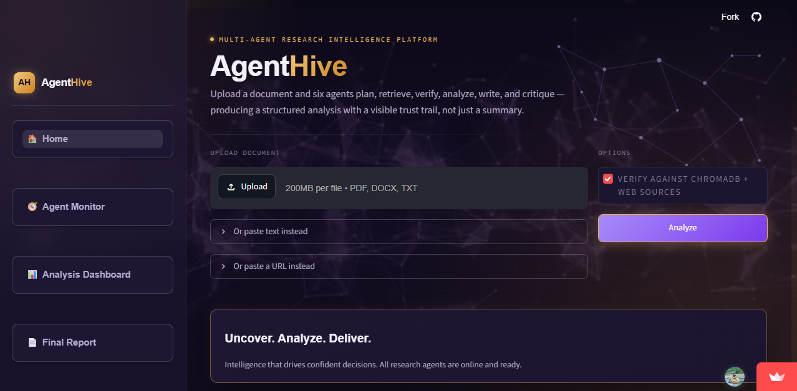
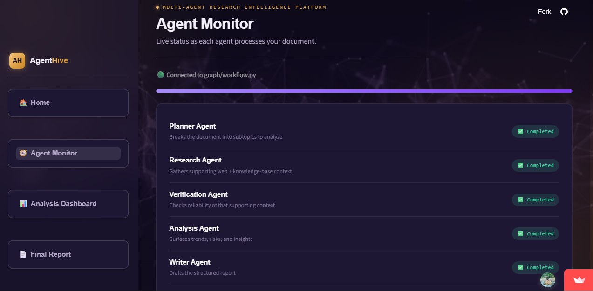
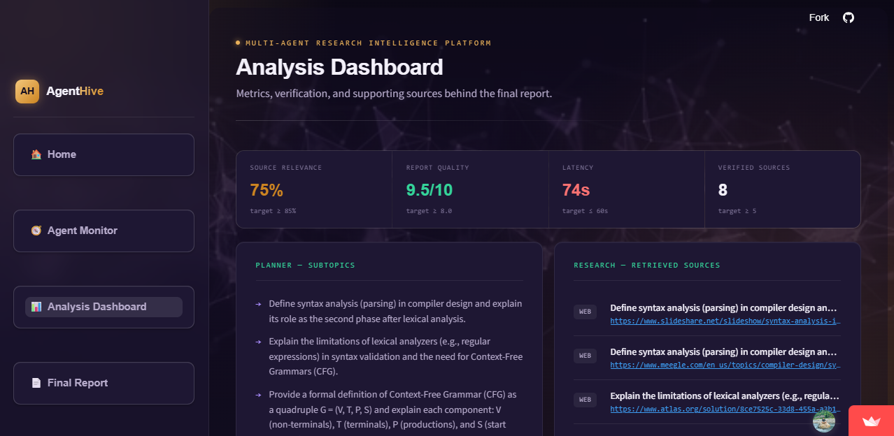
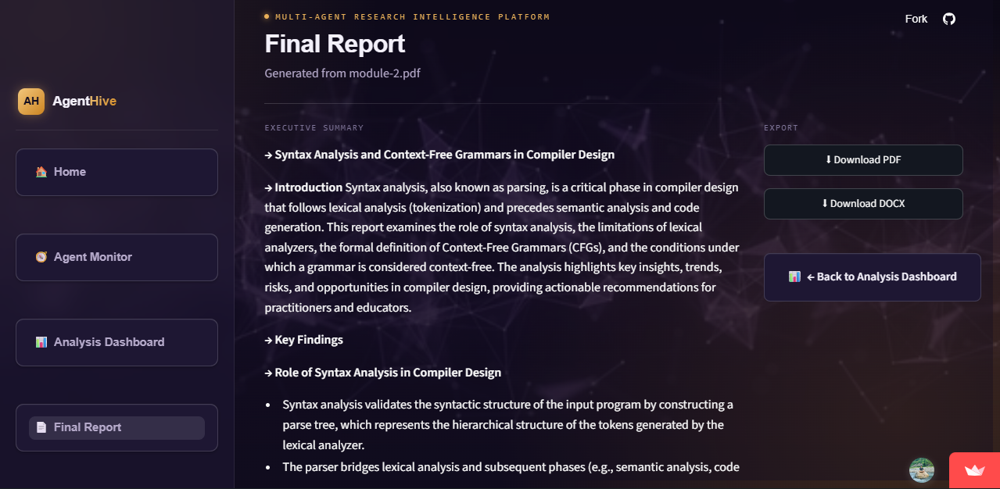

<div align="center">

# 🐝 AgentHive

**Multi-Agent Research Intelligence Platform**

Transform unstructured documents into verified, explainable research reports — powered by a collaborative team of AI agents.

[]()
[]()
[]()
[]()
[]()

</div>

---

## Table of Contents

- [Overview](#overview)
- [Demo](#demo)
- [Key Features](#key-features)
- [System Architecture](#system-architecture)
- [Tech Stack](#tech-stack)
- [Project Structure](#project-structure)
- [How It Works](#how-it-works)
- [Getting Started](#getting-started)
- [Environment Variables](#environment-variables)
- [Running the Application](#running-the-application)
- [Use Cases](#use-cases)
- [Roadmap](#roadmap)
- [Contributors](#contributors)
- [License](#license)

---

## Overview

Most AI assistants hand you an answer with no visibility into how they got there. **AgentHive** takes a different approach: instead of a single model producing a summary, a **team of six specialized agents** work in sequence — planning, researching, verifying, analyzing, writing, and critiquing — so every claim in the final report can be traced back to a source.

Built for researchers, students, analysts, and professionals, AgentHive turns raw documents, URLs, or pasted text into structured, source-backed research reports with a fully visible reasoning pipeline.

---

## Demo

**Upload & Configure**


**Agent Pipeline in Action**


**Final Report — Findings, Concepts & Recommendations**


**Final Report — Verification & Sources**



## Key Features

**📄 Document Intelligence**
- PDF upload and parsing
- Direct text input
- URL-based content extraction
- Automatic document pre-processing

**🤖 Multi-Agent Architecture**
- Planner → Research → Verification → Analysis → Writer → Critic

**🔍 Retrieval & Verification**
- ChromaDB-powered Retrieval-Augmented Generation (RAG)
- Tavily web search integration
- Source verification with trust scoring
- Context-aware retrieval across documents and the web

**📊 Report Generation**
- Executive summaries
- Key findings and important concepts
- Strengths & weaknesses analysis
- Actionable recommendations
- Fully structured, exportable reports

**🖥️ User Experience**
- Interactive Streamlit interface
- Real-time agent workflow monitoring
- Analysis dashboard with a visible trust ledger
- Transparent, step-by-step pipeline — not a black box

---

## System Architecture

```text
                    ┌─────────────────┐
                    │    User Input    │
                    │  PDF / URL / Text│
                    └────────┬─────────┘
                             │
                             ▼
                    ┌─────────────────┐
                    │  Planner Agent   │  → defines strategy & subtopics
                    └────────┬─────────┘
                             ▼
                    ┌─────────────────┐
                    │  Research Agent  │  → gathers supporting context
                    └────────┬─────────┘
                             ▼
                    ┌─────────────────┐
                    │Verification Agent│  → validates & scores sources
                    └────────┬─────────┘
                             ▼
                    ┌─────────────────┐
                    │  Analysis Agent  │  → extracts insights & risks
                    └────────┬─────────┘
                             ▼
                    ┌─────────────────┐
                    │   Writer Agent   │  → compiles the report
                    └────────┬─────────┘
                             ▼
                    ┌─────────────────┐
                    │   Critic Agent   │  → reviews & scores quality
                    └────────┬─────────┘
                             ▼
                    ┌─────────────────┐
                    │   Final Report   │
                    └─────────────────┘
```

---

## Tech Stack

| Layer | Technology |
|---|---|
| Frontend | Streamlit |
| Backend | Python |
| Agent Orchestration | LangChain, LangGraph |
| Language Model | Mistral Small |
| Retrieval & Search | ChromaDB, Tavily Search API |
| Document Processing | PDF parsing, text extraction, URL scraping |

---

## Project Structure

```text
AgentHive/
│
├── agents/
│   ├── planner_agent.py
│   ├── research_agent.py
│   ├── verification_agent.py
│   ├── analysis_agent.py
│   ├── writer_agent.py
│   ├── critic_agent.py
│   └── prompts.py
│
├── assets/                # Screenshots used in this README
├── workflow.py             # LangGraph pipeline orchestration
├── app.py                  # Streamlit entry point
├── pages/
├── ui/
├── data/
├── requirements.txt
└── README.md
```

---

## How It Works

| Step | Agent | Responsibility |
|---|---|---|
| 1 | **Planner** | Breaks the input document down into a research strategy and subtopics |
| 2 | **Research** | Retrieves relevant context from the document and the web |
| 3 | **Verification** | Cross-checks claims against ChromaDB and web sources, assigns trust scores |
| 4 | **Analysis** | Extracts key insights, trends, risks, and opportunities |
| 5 | **Writer** | Compiles verified findings into a structured report with cited sources |
| 6 | **Critic** | Reviews the report for quality, gaps, and improvement opportunities |

Each stage's output is passed to the next, and every intermediate result (subtopics, sources, trust scores, insights) is surfaced in the UI — so you can see exactly how the final report was built, not just the end result.

---

## Getting Started

### Prerequisites
- Python 3.10+
- Mistral API key
- Tavily API key

### Installation

```bash
# Clone the repository
git clone https://github.com/your-username/AgentHive.git
cd AgentHive

# Create and activate a virtual environment
python -m venv .venv

# Windows
.venv\Scripts\activate

# Linux / macOS
source .venv/bin/activate

# Install dependencies
pip install -r requirements.txt
```

---

## Environment Variables

Create a `.env` file in the project root:

```env
MISTRAL_API_KEY=your_api_key
TAVILY_API_KEY=your_api_key
```

---

## Running the Application

```bash
streamlit run app.py
```

---

## Use Cases

- Academic research assistance
- Technical document analysis
- Literature review automation
- Business and market research
- Knowledge extraction
- Competitive intelligence
- Automated research report generation

---

## Roadmap

- [ ] Multi-document comparison
- [ ] Citation generation and tracking
- [ ] Knowledge graph visualization
- [ ] Agent memory and long-term context
- [ ] Support for additional LLM providers
- [ ] Report export to PDF/DOCX
- [ ] Collaborative, multi-user research workflows

---

## Contributors

- Divyanshi Chaudhary
- Drona Acharya
- Harshita
- Pranav Diwakar

---

## Why AgentHive?

AgentHive goes beyond traditional document summarization. By combining RAG, web search, multi-agent verification, and structured reasoning, it produces research outputs that are not just readable — they're **explainable and auditable**, with a visible trail from raw input to final claim.

---

## License

This project is intended for educational, research, and portfolio purposes.